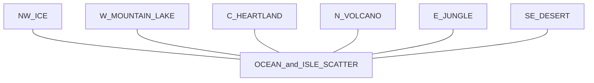

# RuneForged world skeleton (design reference)

High-level region layout from the **RuneForged** world map (archipelago + central continent). Use these IDs for `world/regions/`, loading order, and docs cross-links.

## Region IDs

| ID | Approx. placement | Biome / notes |
|----|-------------------|----------------|
| `NW_ICE` | Northwest | Ice, glacier, frozen coast |
| `N_VOLCANO` | Northeast | Volcanic rock, lava, hazard biome |
| `E_JUNGLE` | East | Lush / magical forest (green + purple) |
| `SE_DESERT` | Southeast | Arid, canyon, major river |
| `C_HEARTLAND` | Center | Largest landmass: forests, mountains, southern basin |
| `W_MOUNTAIN_LAKE` | West | Hills, forest, prominent inland lake |
| `OCEAN` | Between land | Shallow shelf to deep water (matches water shader / swim tuning) |
| `ISLE_SCATTER` | Mid-ocean dots | Small islands / atolls for one-off content |

## ASCII skeleton

```text
                    [ NW_ICE ]
                         |
    [ W_MOUNTAIN_LAKE ]--+--[ N_VOLCANO ]
           |             |        |
           +-----[ C_HEARTLAND ]---+-----[ E_JUNGLE ]
                         |                    |
                    [ SE_DESERT ]
              (ISLE_SCATTER throughout OCEAN)
```

## Diagram (Mermaid)



## Terrain3D vs. separate scenes (recommended direction)

- **Avoid** one monolithic Terrain3D for the entire illustrated world unless you have a committed pipeline and performance budget.
- **Prefer** a **hybrid**: Terrain3D (or Terrain3D regions) **per major outdoor area**, packaged as **region scenes** under `world/regions/`, with a parent world or loader that streams what surrounds the player.
- **Water**: use separate `WaterSurface` / volumes where **sea level differs** (ocean vs. inland lakes), aligned with gameplay `water_level` queries.

This matches small-team iteration: build **tutorial / heartland-sized** chunks first, then add regions without blocking the whole map.
